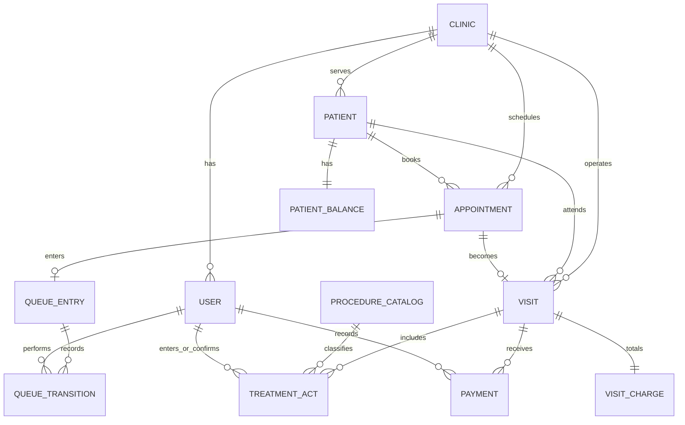

# Architecture Decision Document

_This document builds collaboratively through step-by-step discovery. Sections are appended as we work through each architectural decision together._

## Pre-Architecture Locked Decisions

### 1) RTL/LTR Strategy (Next.js + Tailwind + MUI)

**Decision:** Use document-level direction with dual Emotion caches and locale-rooted layout.

- Next.js locale segment controls `lang` and `dir` on `<html>`.
- MUI uses conditional Emotion cache:
  - LTR cache for French/English
  - RTL cache with `stylis-plugin-rtl` for Arabic
- Tailwind uses RTL/LTR variants and logical utilities (`ms/me/ps/pe`) instead of physical direction utilities (`ml/mr/pl/pr`).
- Avoid `space-x-*` in directional layouts; prefer `gap-*`.
- Add RTL/LTR visual regression coverage for critical journeys.

**Rationale:** Prevents MUI/Tailwind direction conflicts and makes RTL a first-class architectural property rather than a late-stage patch.

### 2) Real-Time Waiting Room Strategy

**Decision:** Use **SSE + REST mutations + NATS pub/sub** (updated in Step 4 — Redis replaced by NATS).

- Server push channel: SSE (`text/event-stream`) for queue updates.
- Write operations: REST endpoints (e.g., status transition PATCH).
- Reconnect behavior: client auto-reconnect + explicit snapshot resync endpoint.
- Fanout backbone: NATS pub/sub replaces Redis — API Gateway subscribes to `queue.status.updated` and fans out to SSE clients per `clinic_id`.
- Redis is **not required** for real-time; add only if token blacklisting or rate-limiting state is needed.

**Rationale:** NATS is already in the architecture for async events — using it as the SSE fanout backbone removes Redis as a mandatory dependency and simplifies the infrastructure baseline.

### 3) `clinic_id` Scoping Strategy

**Decision:** Hybrid transport with **token-enforced authorization**.

- **JWT claim is source of truth** for effective clinic scope.
- Route clinic context (`/c/:clinicSlug`) is for UX/public discovery context.
- Header clinic hints are optional and never trusted from browser clients.
- API rejects route/header clinic mismatches against token scope.
- All DB reads/writes enforce `clinic_id` filtering.
- SSE subscriptions and audit logs are always clinic-scoped.

**Rationale:** Ensures cross-clinic access is architecturally impossible while keeping clean URL UX and future V2 multi-tenant extensibility.

## Project Context Analysis

### Requirements Overview

**Functional Requirements:**
The project defines 41 FRs spanning 8 architectural domains: authentication and role lifecycle, multi-channel appointment management, real-time waiting room operations, clinical treatment records with confirmation workflow, patient longitudinal records, checkout and balance carry-forward, trilingual localization, and admin configuration/oversight.
Architecturally, this implies a role-segmented application shell, strongly guarded API boundaries, event-driven queue updates, and a domain model that preserves visit-state integrity from intake through checkout.

**Non-Functional Requirements:**
The system is constrained by strict NFRs: queue/event propagation within 3 seconds, dashboard/booking responsiveness, encryption in transit and at rest, short-lived JWT with refresh rotation, immutable patient-record audit logs, and hard clinic data isolation.
Localization NFRs require pixel-accurate Arabic RTL behavior, instant language switching, and locale-specific formatting. Reliability NFRs require reconnect and state resync within 10 seconds after real-time link loss.

**Scale & Complexity:**
DentilFlow is a high-complexity, compliance-sensitive SaaS product with concurrent role workflows and real-time operational coupling.

- Primary domain: Full-stack web SaaS for dental clinic operations
- Complexity level: High
- Estimated architectural components: 14–18 core components/services (auth, RBAC guard, clinic scoping, appointment engine, queue real-time pipeline, treatment workflow, checkout/balance, patient record service, notification service, consent/audit subsystem, i18n/RTL infrastructure, admin config, observability, integration adapters)

### Technical Constraints & Dependencies

- Stack and platform constraints: MERN + Next.js SSR, responsive web first, role-specific UX shells.
- Security constraints: API-enforced RBAC, JWT expiry/rotation, TLS, AES-256 at rest, immutable audit logging.
- Compliance constraints: PDPC/CNDP/INPDP/GDPR-aligned handling, explicit consent text by locale.
- Real-time constraints: low-latency queue synchronization and reconnect/resync behavior.
- Integration dependencies: WhatsApp Business API (primary notifications), transactional email fallback.
- Product boundary constraints: no EMR/EHR and no payment gateway in MVP.
- Data model constraint: mandatory `clinic_id` scoping from day one to preserve V2 multi-tenant migration path.

### Cross-Cutting Concerns Identified

- Authorization and role-boundary enforcement across all endpoints.
- Tenant isolation and anti-leak guarantees (`clinic_id` everywhere).
- Real-time consistency and conflict-safe transitions across secretary/doctor/assistant views.
- Localization infrastructure (Arabic RTL + French/English LTR parity).
- Compliance, consent, and immutable auditability.
- Notification decoupling and delivery fallback behavior.
- Accessibility and responsive usability in high-frequency operational screens.
- Observability for latency, sync failures, and security-critical events.

## Starter Template Evaluation

### Primary Technology Domain

Full-stack web SaaS with Next.js-first frontend architecture.

### Starter Options Considered

- `create-next-app`: Best alignment with required App Router + TypeScript + Tailwind + SSR conventions.
- Vite React starter: Strong DX for SPA, but less aligned with current SSR and route architecture needs.
- `create-t3-app`: Powerful typed full-stack starter but introduces optional stack opinions not required for the current baseline.

### Selected Starter: create-next-app

**Rationale for Selection:**
Provides the cleanest alignment with the documented frontend architecture while preserving flexibility for backend architecture choices.

**Initialization Command:**

```bash
npm create next-app@latest dentiflow-frontend --typescript --eslint --tailwind --app --src-dir --import-alias "@/*"
```

**Architectural Decisions Provided by Starter:**

**Language & Runtime:**

- TypeScript-first Next.js setup

**Styling Solution:**

- Tailwind preconfigured and compatible with planned MUI integration

**Build Tooling:**

- Next.js App Router conventions and production build pipeline

**Testing Framework:**

- Not fully scaffolded by default; to be explicitly defined in core architecture decisions

**Code Organization:**

- App Router filesystem conventions with `src/` layout and `@/*` import aliasing

**Development Experience:**

- Standard scripts, lint baseline, rapid local dev loop

### Technical Preference Addendum (Captured Before Step 4)

- Frontend: Next.js + TypeScript + Tailwind + MUI
- Backend direction to formalize in Step 4: NestJS + Clean Architecture + microservices
- Communication preference to formalize in Step 4: NATS (async) + gRPC (sync)
- Database choice to finalize in Step 4: MySQL vs MongoDB

## Core Architectural Decisions

### Decision Priority Analysis

**Critical Decisions (Block Implementation):**

- Backend architecture: NestJS microservices with Clean Architecture per service
- Service communication split: NATS (async events) + gRPC (sync internal RPC)
- Database engine: MySQL (ACID-compliant, relational integrity for financial/clinical workflows)
- API ingress: API Gateway as a NestJS microservice with HTTP ingress layer
- Auth + tenant enforcement: JWT verified at gateway, propagated as trusted claims to services

**Important Decisions (Shape Architecture):**

- Service boundaries and ownership (10 bounded services defined below)
- Outbox pattern for reliable async event publication
- Idempotent consumers with deduplication on NATS
- NATS replaces Redis as SSE fanout backbone
- Observability: OpenTelemetry tracing + structured logs + correlation IDs

**Deferred (Post-MVP):**

- Full event sourcing
- CQRS read replicas per domain
- Multi-region active-active topology

---

### Data Architecture

**Database Engine: MySQL 8.4 LTS (mysql2 v3.20.0)**

Chosen over MongoDB for DentilFlow because:

- ACID transactions required for checkout, balance carry-forward, and treatment record confirmation workflows
- Relational integrity is natural for clinic/patient/appointment/visit/payment relationships
- Better posture for compliance audit trails and regulatory queries (PDPC/CNDP/INPDP/GDPR)
- Easier reporting and financial aggregation evolution

**Data Modeling Approach:**

- Each microservice owns its schema; no cross-service joins
- All domain tables include `clinic_id` for future multi-tenant partitioning (mandatory, non-negotiable)
- Outbox table per write-service for guaranteed-at-least-once event publication to NATS
- TypeORM is used in Data Mapper mode with explicit Repository pattern (no Active Record)
- Domain models remain persistence-agnostic; mapping between domain entities and DB entities is mandatory

**Validation Strategy:**

- NestJS `class-validator` + `class-transformer` on all inbound DTOs at ingress
- Domain invariants enforced inside use-cases (Clean Architecture core layer, no framework dependency)
- Database-level constraints as last line of defense

**Migration Approach:**

- TypeORM migrations per service, isolated and independently runnable
- No cross-service DB migrations

**Repository & Mapper Pattern (Required):**

- Repository interfaces are declared in `domain/` or `application/ports/`
- TypeORM repository implementations live in `infrastructure/persistence/repositories/`
- Dedicated mappers translate between:
  - DB entities ↔ domain entities
  - Domain entities ↔ response DTOs
- Business use-cases must never depend on TypeORM entities directly

### Database Design (Conceptual + Logical)

#### Conceptual Model (MVP)

DentilFlow MVP data is modeled around one core business flow:

`Patient` → `Appointment` → `Queue Transition` → `Visit/Treatment` → `Checkout/Payment` → `Balance`.

To keep service autonomy and future V2 multi-tenant evolution intact, the conceptual model is split by bounded context:

- **Identity & Access (auth-service):** users, sessions, refresh lifecycle, role claims.
- **Clinic Configuration (clinic-service):** clinic profile, working hours, staff-role assignment.
- **Scheduling (appointment-service):** appointments, slot allocation, intake channel metadata.
- **Waiting Room (queue-service):** queue state machine and transition history.
- **Clinical Treatment (treatment-service):** procedure catalog, visit treatment acts, doctor confirmation.
- **Checkout & Financials (checkout-service):** invoices/visit totals, payments, outstanding balances.
- **Patient Longitudinal View (patient-service):** denormalized patient timeline read model.
- **Compliance (audit-service):** immutable access and mutation event ledger.

**Core conceptual relationships:**

- One `clinic` has many `users`, `patients`, `appointments`, and `visits`.
- One `patient` has many `appointments` and many `visits`.
- One `appointment` maps to zero or one active `queue entry`.
- One `visit` has many `treatment acts`.
- One `visit` can have many `payments`.
- Patient `balance` is the cumulative result of visit totals minus payments.

#### Conceptual ER Diagram (MVP)



Notes:

- Diagram is conceptual and cross-service; physical foreign keys are enforced only within service-owned schemas.
- `clinic_id` is mandatory on all domain tables even when not shown on every edge.

#### Logical Model (MVP Schema Blueprint)

Each write service owns its schema; logical foreign keys across services are represented by IDs and validated through service contracts (gRPC), not DB joins.

| Service               | Schema            | Primary Tables (MVP)                                                | Notes                             |
| --------------------- | ----------------- | ------------------------------------------------------------------- | --------------------------------- |
| `auth-service`        | `auth_db`         | `users`, `user_credentials`, `refresh_tokens`, `auth_outbox`        | JWT identity source of truth      |
| `clinic-service`      | `clinic_db`       | `clinics`, `clinic_staff`, `working_hours`, `clinic_outbox`         | Clinic config + role binding      |
| `appointment-service` | `appointment_db`  | `patients`, `appointments`, `slot_locks`, `appointment_outbox`      | Intake + conflict prevention      |
| `queue-service`       | `queue_db`        | `queue_entries`, `queue_transitions`, `queue_outbox`                | Real-time waiting room state      |
| `treatment-service`   | `treatment_db`    | `procedure_catalog`, `visits`, `treatment_acts`, `treatment_outbox` | Clinical act lifecycle            |
| `checkout-service`    | `checkout_db`     | `visit_charges`, `payments`, `patient_balances`, `checkout_outbox`  | Financial closure + carry-forward |
| `patient-service`     | `patient_read_db` | `patient_profiles`, `patient_timeline_items`                        | Read-optimized longitudinal view  |
| `audit-service`       | `audit_db`        | `audit_events`                                                      | Append-only immutable ledger      |

#### Entity-Level Logical Definitions

**Global column standards (all domain tables):**

- `id CHAR(36)` (UUID v4, PK)
- `clinic_id CHAR(36)` (required, indexed)
- `created_at DATETIME(6)`
- `updated_at DATETIME(6)`
- Soft-delete is optional per table (`deleted_at DATETIME(6)` when needed)

**Scheduling and patient intake:**

- `patients`
  - Unique: `uk_patients_clinic_phone (clinic_id, phone)`
  - Optional unique: `uk_patients_clinic_email (clinic_id, email)`
- `appointments`
  - Key columns: `patient_id`, `doctor_id`, `scheduled_start_at`, `scheduled_end_at`, `intake_channel`, `status`
  - Status enum: `booked | confirmed | cancelled | no_show | completed`
  - Indexes:
    - `idx_appointments_clinic_start (clinic_id, scheduled_start_at)`
    - `idx_appointments_clinic_doctor_start (clinic_id, doctor_id, scheduled_start_at)`
    - `idx_appointments_clinic_patient (clinic_id, patient_id)`
- `slot_locks` (short-lived conflict-guard records)
  - Unique: `uk_slot_locks_clinic_doctor_range_hash (clinic_id, doctor_id, slot_hash)`

**Queue operations:**

- `queue_entries`
  - Key columns: `appointment_id`, `patient_id`, `doctor_id`, `current_state`, `entered_at`, `last_transition_at`
  - State enum: `arrived | waiting | in_chair | done`
  - Unique: `uk_queue_entries_clinic_appointment (clinic_id, appointment_id)`
  - Index: `idx_queue_entries_clinic_state_time (clinic_id, current_state, last_transition_at)`
- `queue_transitions`
  - Key columns: `queue_entry_id`, `from_state`, `to_state`, `transitioned_by_user_id`, `transitioned_at`
  - Immutable transition log for operational traceability

**Treatment domain:**

- `procedure_catalog`
  - Unique: `uk_procedure_catalog_clinic_code (clinic_id, procedure_code)`
  - Key columns: `name`, `default_price_minor`, `is_active`
- `visits`
  - Key columns: `appointment_id`, `patient_id`, `doctor_id`, `started_at`, `closed_at`, `confirmation_status`
  - Confirmation enum: `draft | pending_doctor_confirmation | confirmed | closed`
- `treatment_acts`
  - Key columns: `visit_id`, `tooth_fdi`, `procedure_code`, `unit_price_minor`, `quantity`, `entered_by_user_id`, `confirmed_by_user_id`
  - Constraint: cannot be billed unless doctor-confirmed
  - Index: `idx_treatment_acts_clinic_visit (clinic_id, visit_id)`

**Checkout and balances:**

- `visit_charges`
  - One row per visit closure summary
  - Key columns: `visit_id`, `subtotal_minor`, `discount_minor`, `total_minor`, `currency`
  - Unique: `uk_visit_charges_clinic_visit (clinic_id, visit_id)`
- `payments`
  - Key columns: `visit_id`, `patient_id`, `amount_minor`, `method`, `recorded_by_user_id`, `recorded_at`
  - Method enum: `cash | card | transfer | other`
  - Indexes:
    - `idx_payments_clinic_patient_time (clinic_id, patient_id, recorded_at)`
    - `idx_payments_clinic_visit (clinic_id, visit_id)`
- `patient_balances`
  - Key columns: `patient_id`, `outstanding_minor`, `last_calculated_at`
  - Unique: `uk_patient_balances_clinic_patient (clinic_id, patient_id)`

**Audit and event reliability:**

- `*_outbox` tables (one per write service)
  - Required columns: `event_id`, `aggregate_id`, `event_type`, `payload_json`, `occurred_at`, `published_at`, `retry_count`
  - `event_id` unique for idempotent publication/consumption
- `audit_events`
  - Append-only columns: `event_id`, `clinic_id`, `actor_user_id`, `subject_type`, `subject_id`, `action`, `occurred_at`, `payload_json`
  - No update/delete operations allowed

#### Logical Integrity Rules (Must Enforce)

- Every query path must include `clinic_id` predicate.
- No cross-clinic uniqueness constraints; uniqueness is always scoped by `clinic_id`.
- Queue state transitions must follow allowed graph only:
  - `arrived → waiting → in_chair → done`
- `visit` closure requires doctor confirmation of all billable acts.
- `patient_balances.outstanding_minor` must satisfy:
  - prior balance + visit totals − payments (never derived from UI values).
- Outbox event write must be in the same transaction as the domain mutation.

#### Retention and Compliance Notes (MVP)

- Patient-facing and financial records: retained per local legal/compliance policy baseline (configurable retention policy in V2).
- Audit events: immutable and retained for full compliance horizon.
- Sensitive payloads in `payload_json` must be minimized and encrypted where applicable.

---

### Authentication & Security

**Auth Model: JWT access + rotating refresh tokens**

- Access token TTL: 15 minutes
- Refresh token: rotated on every use, invalidated on logout
- Token payload: `{ user_id, clinic_id, role, iat, exp }`
- V2 extension: `allowed_clinic_ids[]` + `active_clinic_id` for multi-tenant

**Authentication Framework: Passport.js Strategy Pattern (NestJS integration)**

- Passport.js is the standard auth strategy framework across auth flows
- Local strategy for email/password login
- JWT strategy for protected API access
- OAuth strategies for social login (initially Google; extensible to Facebook/Apple if needed)
- Registration and login orchestration remains in `auth-service`; gateway consumes signed JWT output
- Strategy implementations are reusable and versioned to avoid per-service auth drift

**Gateway Auth Enforcement:**

- API Gateway verifies JWT signature on every inbound request
- Resolved `effectiveClinicId` extracted from token claims, not from request header or URL
- Clinic slug in URL (`/c/:clinicSlug`) is for UX/SEO only — never trusted for authorization
- Propagates verified identity as internal gRPC metadata to downstream services

**Service-Level Defense-in-Depth:**

- Each service independently validates role claims from gateway metadata
- No service trusts unauthenticated internal calls — internal mTLS or token propagation enforced

**Security Controls:**

- TLS everywhere (external + internal)
- AES-256 encryption at rest for patient data
- Immutable audit events via `audit-service` (NATS subscriber, append-only store)
- All patient record access/mutation emits an audit event

---

### API & Communication Patterns

**External Ingress: REST via API Gateway**

- Internet-facing REST only; no gRPC or NATS exposed externally
- Gateway is itself a NestJS application with HTTP ingress + microservice client connections
- OpenAPI documentation generated at gateway boundary

**Internal Sync Communication: gRPC (grpc-js v1.14.3)**

- Used for request/response calls where immediate response is required
- e.g., appointment booking conflict check, patient record retrieval, checkout calculation
- Proto definitions are the shared contract — stored in a shared `proto/` package

**Internal Async Communication: NATS (nats v2.29.3)**

- Used for domain events that trigger side effects across service boundaries
- e.g., `appointment.confirmed` → notification-service sends WhatsApp/email
- e.g., `queue.status.updated` → gateway fans out to SSE clients
- e.g., `visit.closed` → audit-service logs

**SSE Real-Time Push (browser-facing):**

- SSE remains as the browser push channel (no WebSocket)
- API Gateway subscribes to NATS `queue.status.updated` events scoped by `clinic_id`
- Gateway fans out to all SSE connections for that clinic
- NATS **replaces Redis pub/sub** as the fanout backbone — Redis is no longer required for this flow

**Event Reliability:**

- Outbox pattern on write-services: event is persisted in same DB transaction as domain mutation
- Outbox relay publishes to NATS after commit
- NATS consumers are idempotent — deduplicate by event ID
- Dead-letter subject + retry policy for failed consumers

---

### Microservice Boundaries

| Service                  | Responsibility                                                | Inbound         | Outbound          |
| ------------------------ | ------------------------------------------------------------- | --------------- | ----------------- |
| **api-gateway**          | Auth, tenant resolution, REST → internal dispatch, SSE fanout | REST (HTTP)     | gRPC + NATS pub   |
| **auth-service**         | JWT issue/refresh/revoke, user identity                       | gRPC            | NATS events       |
| **clinic-service**       | Clinic config, working hours, staff management                | gRPC            | NATS events       |
| **appointment-service**  | Booking, slot conflict prevention, multi-channel intake       | gRPC            | NATS events       |
| **queue-service**        | Waiting room state machine, status transitions                | gRPC            | NATS events       |
| **treatment-service**    | Act catalog, treatment records, doctor confirmation workflow  | gRPC            | NATS events       |
| **checkout-service**     | Payment recording, balance carry-forward, visit closure       | gRPC            | NATS events       |
| **patient-service**      | Patient records, demographics, appointment/treatment history  | gRPC            | —                 |
| **notification-service** | WhatsApp + email dispatch, retry, channel fallback            | NATS subscriber | External APIs     |
| **audit-service**        | Immutable event log of all patient data access and mutations  | NATS subscriber | Append-only store |

**Gateway is a NestJS microservice** with HTTP ingress — it does not bypass the microservice model.

---

### Frontend Architecture

- Next.js 15+ App Router + TypeScript
- Authentication on frontend uses NextAuth v4 (Auth.js v4) with Passport-compatible OAuth providers (Google first)
- MUI v6 + Tailwind v4 with locked RTL/LTR dual-cache strategy
- Role-segmented application shells (Patient mobile shell, Staff/Admin dashboard shell)
- `clinic_id` scope enforced from auth context — never inferred from URL
- SSE client subscribes to `/events/queue` on API Gateway for real-time queue updates
- Reconnect + snapshot resync on `EventSource` error/close events
- i18n via `next-intl` or equivalent for `[locale]` route segment with Arabic RTL + French/English LTR
- App Router entrypoint remains at `src/app` (framework requirement); clean architecture layers live alongside it

**Frontend Clean Architecture (Required):**

- `domain/`: pure business models, value objects, and domain rules (framework-agnostic)
- `application/`: use-cases and orchestration logic (no UI framework code)
- `infrastructure/`: API clients, SSE adapters, storage adapters, mapper implementations
- `presentation/`: React components, hooks, and view models (no routing ownership)
- `app/`: Next.js App Router adapter layer only (`layout.tsx`, `page.tsx`, route handlers)
- `shared/`: cross-cutting UI/core helpers (constants, utils, common types)
- Dependency direction must remain inward (`app/presentation` -> `application` -> `domain`)
- No direct HTTP/SSE calls inside page components; always through application/infrastructure ports

**NextAuth v4 Integration Rules:**

- NextAuth route handler is defined at `src/app/api/auth/[...nextauth]/route.ts`
- Session strategy: JWT
- Providers: OAuth (Google first) + Credentials when required
- NextAuth callbacks map identity/session claims to backend-required claims (`user_id`, `role`, `clinic_id`)
- NextAuth is the frontend auth boundary; `auth-service` remains source of truth for account lifecycle and token issuance policy

---

### Infrastructure & Deployment

**MVP Deployment: Docker Compose**

- Each microservice is containerized as a standalone Docker image
- `docker-compose.yml` orchestrates all services for both dev and production environments
- Dev compose: includes hot-reload volumes, debug ports, local NATS and MySQL containers
- Prod compose: hardened images, no dev tooling, environment variables via secrets/env files
- No Kubernetes at MVP — K8s is a post-MVP upgrade path once the service mesh stabilizes

**Service Container Strategy:**

- Each NestJS service has its own `Dockerfile` (multi-stage: build → production)
- Frontend (Next.js) has its own `Dockerfile` (multi-stage: build → standalone output)
- Shared `docker-compose.override.yml` for local dev overrides
- All images versioned and tagged per service independently

**Infrastructure Services (Docker Compose managed):**

- NATS (JetStream enabled) — single node at MVP, cluster in V2
- MySQL 8.4 LTS — single instance at MVP, HA replica in V2
- Redis: **optional only** — add if token blacklisting or rate-limiting state is needed

**Post-MVP Infrastructure Roadmap:**

- Phase 2: Migrate to Kubernetes (service manifests, Helm charts, horizontal pod autoscaling)
- Phase 2: Add CI/CD pipeline (GitHub Actions or equivalent) for automated build, test, and deploy
- Phase 2: NATS cluster (3 nodes) and MySQL HA replica
- Phase 3: Multi-region deployment, managed DB services, observability stack (Grafana/Loki/Tempo)

**Observability Baseline (MVP):**

- Structured JSON logs with `clinic_id`, `user_id`, `trace_id` on every log entry
- OpenTelemetry tracing instrumentation in place (exportable to any backend when added)
- Metrics collection ready (Prometheus-compatible exporters) — dashboard added post-MVP
- Alerting post-MVP alongside K8s and CI/CD

---

### Decision Impact Analysis

**Implementation Sequence:**

1. Define proto contracts and NATS subject schema before any service implementation begins
2. Implement gateway auth and tenant resolution first — all other services depend on it
3. Build core write paths with MySQL + outbox per service
4. Add NATS consumers (notification, audit) once event contracts are stable
5. Wire SSE fanout at gateway for queue service events
6. Add observability instrumentation across all services

**Cross-Component Dependencies:**

- Auth and `clinic_id` tenant scope affect every service, every query, every event
- gRPC proto definitions are a shared contract — changes require coordinated updates
- NATS subject naming must be centrally governed — inconsistency causes silent consumer misses
- Outbox relay must be operational before notification and audit services are meaningful

## Implementation Patterns & Consistency Rules

### Critical Conflict Points Identified

17 areas where AI agents could make incompatible micro-decisions without explicit rules.

---

### Naming Patterns

**Database Naming (MySQL snake_case convention):**

- Tables: `plural_snake_case` → `appointments`, `treatment_acts`, `patient_records`
- Columns: `snake_case` → `clinic_id`, `created_at`, `patient_id`
- Foreign keys: `{entity}_id` → `appointment_id`, `doctor_id`
- Indexes: `idx_{table}_{column(s)}` → `idx_appointments_clinic_id`
- Audit columns required on every table: `created_at`, `updated_at`, `clinic_id`

**REST API Endpoints:**

- Plural, kebab-case resource names → `/appointments`, `/treatment-acts`, `/waiting-room/queue`
- Route parameters: `:id` (UUID v4)
- Query parameters: `camelCase` → `?clinicId=`, `?page=`, `?limit=`
- Versioning: `/api/v1/` prefix at gateway

**TypeScript Code Naming:**

- Files: `kebab-case.ts` → `appointment.service.ts`, `create-appointment.dto.ts`
- Classes: `PascalCase` → `AppointmentService`, `CreateAppointmentDto`
- Functions/variables: `camelCase` → `getAppointmentById`, `clinicId`
- Constants: `UPPER_SNAKE_CASE` → `MAX_RETRY_COUNT`, `JWT_EXPIRY_SECONDS`
- Interfaces/types: no `I` prefix — prefer descriptive names → `AppointmentRepository`, `QueueState`

**NATS Subject Naming:**

- Pattern: `{service}.{entity}.{past-tense-event}`
- Examples: `appointment.booking.confirmed`, `queue.status.updated`, `visit.treatment.closed`, `patient.record.accessed`
- Subjects are **centrally documented** — agents must not invent new subjects without updating the subject registry

**gRPC Service and Method Naming:**

- Service: `{Domain}Service` → `AppointmentService`, `QueueService`, `PatientService`
- Methods: `PascalCase` verb-noun → `CreateAppointment`, `GetPatientQueue`, `ConfirmTreatmentActs`
- Proto file naming: `{service}.proto` → `appointment.proto`, `queue.proto`

---

### Structure Patterns

**NestJS Service Internal Structure (Clean Architecture):**

```
src/
  application/        # use-cases, DTOs, repository interfaces, service interfaces
  domain/             # entities, value objects, domain services, domain exceptions
  infrastructure/     # TypeORM repositories, NATS emitters, gRPC adapters, external API clients
  presentation/       # NestJS controllers, gRPC handlers, NATS consumers
  shared/             # guards, interceptors, exception filters, shared value objects
main.ts               # Bootstrap — HTTP + microservice hybrid where applicable
```

**Test Co-location:**

- Unit tests: `*.spec.ts` co-located with source file in same directory
- E2E tests: `/test/` directory at service root
- No separate `__tests__/` folder convention

**Monorepo Layout:**

```
dentiflow/
  apps/
    api-gateway/
    auth-service/
    appointment-service/
    queue-service/
    treatment-service/
    checkout-service/
    patient-service/
    clinic-service/
    notification-service/
    audit-service/
    frontend/           # Next.js app
  packages/
    proto/              # Shared .proto definitions
    shared-types/       # Shared TypeScript types/interfaces
    shared-events/      # NATS event payload type definitions
    shared-db/          # Shared DB module primitives (TypeORM bootstrap, base repositories, migration helpers)
    shared-logger/      # Shared structured logger module and trace context helpers
    shared-config/      # Shared config loader/validation module
  docker-compose.yml
  docker-compose.override.yml
```

**Frontend Internal Structure (Clean Architecture):**

```text
apps/frontend/src/
├── app/
│   ├── [locale]/
│   │   ├── layout.tsx
│   │   ├── page.tsx
│   │   ├── patient/
│   │   ├── secretary/
│   │   ├── doctor/
│   │   ├── assistant/
│   │   └── admin/
│   └── api/
│       └── auth/
│           └── [...nextauth]/
│               └── route.ts
├── domain/
│   ├── entities/
│   ├── value-objects/
│   └── services/
├── application/
│   ├── use-cases/
│   ├── ports/
│   └── dto/
├── infrastructure/
│   ├── api/
│   ├── sse/
│   ├── auth/
│   ├── storage/
│   └── mappers/
├── presentation/
│   ├── components/
│   ├── hooks/
│   └── view-models/
└── shared/
    ├── constants/
    ├── utils/
    └── types/
```

**Shared Module Reuse Rule:**

- DB, logger, and config modules are shared packages and imported by all microservices
- Do not recreate these modules per service
- Each service only declares service-specific extensions over shared bases

---

### Format Patterns

**API Response Envelope (all REST responses from Gateway):**

```json
{
  "success": true,
  "data": { ... },
  "meta": { "page": 1, "limit": 20, "total": 42 }
}
```

- `meta` is omitted for non-paginated responses
- `data` is always an object or array — never a primitive directly

**Error Response Format:**

```json
{
  "success": false,
  "error": {
    "code": "APPOINTMENT_CONFLICT",
    "message": "This slot is no longer available.",
    "details": []
  }
}
```

- `details[]` contains field-level validation errors for `422` responses
- `code` is a machine-readable `SCREAMING_SNAKE_CASE` string
- HTTP status codes used semantically: `200`, `201`, `400`, `401`, `403`, `404`, `409`, `422`, `500`
- **Never** return `200` with an error body

**Date/Time Format:**

- All API date/time fields: **ISO 8601 UTC strings** → `"2026-04-07T09:30:00Z"`
- No Unix timestamps in API responses or event payloads
- Timezone conversion is a **frontend-only** responsibility
- DB stores UTC; display formatting happens at render time per active locale

**JSON Field Naming in API responses:** `camelCase` throughout

---

### Communication Patterns

**NATS Event Payload Structure (every event must include):**

```json
{
  "eventId": "uuid-v4",
  "eventType": "appointment.booking.confirmed",
  "clinicId": "uuid-v4",
  "occurredAt": "2026-04-07T09:30:00Z",
  "payload": { ... }
}
```

- `eventId`: enables idempotency deduplication at consumer side
- `clinicId`: enables scope filtering without payload inspection
- `occurredAt`: domain time of event (not broker receipt time)
- Consumers store processed `eventId` values to deduplicate replays

**gRPC Error Propagation:**

- Use gRPC status codes (`NOT_FOUND`, `ALREADY_EXISTS`, `PERMISSION_DENIED`, etc.)
- Gateway maps gRPC status to HTTP status in the error envelope
- Never expose internal service error details to external API consumers

**SSE Event Format (browser-facing):**

```
event: queue.update
data: {"patientId":"...","status":"IN_CHAIR","clinicId":"...","updatedAt":"..."}
id: {eventId}
```

- `id:` field enables `Last-Event-ID` reconnect replay
- Gateway always emits a `snapshot` event on new SSE connection (current full queue state)

---

### Process Patterns

**Error Handling:**

- Global `ExceptionFilter` in each NestJS service catches all unhandled errors
- Domain exceptions are typed classes thrown from use-cases only (never from controllers or infrastructure)
- NATS consumer failures: log with trace context → retry up to 3 times → publish to DLQ subject `{original.subject}.dlq`
- Silent error swallowing is **forbidden** — every caught error must be logged with `trace_id` + `clinic_id`

**Loading & Async State (Frontend):**

- Use React Query (TanStack Query) for server state — no manual loading/error state for API calls
- SSE connection state managed by a dedicated `useQueueSync` hook
- Optimistic UI updates for queue status transitions; rollback on error

**Validation Timing:**

- Backend: DTO validation at NestJS controller boundary (before use-case invocation)
- Frontend: inline validation on blur + final validation on submit (never block UX for async validation)

**Persistence Implementation Pattern:**

- Always implement persistence through Repository interfaces + mapper classes
- TypeORM entities are infrastructure-only and must not leak into use-case/application layers
- Mapper naming convention: `{Domain}PersistenceMapper` and `{Domain}ResponseMapper`

**Frontend Application Pattern:**

- UI components/pages must call application use-cases, not raw API clients
- API/SSE clients are only allowed under `infrastructure/`
- UI-facing transformations use mapper/view-model adapters under `presentation/` and `infrastructure/mappers`
- Domain entities must never import React/Next.js types

---

### Enforcement Rules for All AI Agents

**MUST:**

- Apply `clinic_id` filter on **every** DB query — no exceptions, ever
- Emit an audit event for every patient record access or mutation
- Use the standard response envelope on all REST responses
- Use ISO 8601 UTC strings for all date/time fields in API and event payloads
- Include `eventId`, `clinicId`, `occurredAt` in every NATS event
- Co-locate unit tests as `*.spec.ts` in the same directory as source
- Use `class-validator` DTOs at all NestJS ingress boundaries
- Follow the monorepo `apps/` and `packages/` layout
- Reuse shared `shared-db`, `shared-logger`, and `shared-config` modules across all services
- Implement all DB access via Repository + Mapper patterns (TypeORM Data Mapper mode)
- Use Passport.js strategies for auth flows (Local/JWT/OAuth)
- Apply Clean Architecture layers in frontend (`domain`, `application`, `infrastructure`, `presentation`, `shared`)
- Keep frontend dependency direction inward and framework-free in `domain` and `application`

**MUST NOT:**

- Expose gRPC or NATS directly to external (internet-facing) clients
- Infer or trust `clinic_id` from URL parameters or request headers for authorization
- Perform DB joins or queries across service-owned schemas
- Use `any` TypeScript type without an explicit inline justification comment
- Return HTTP `200` with an error body
- Invent new NATS subjects without registering them in `packages/shared-events/`
- Store timezone-aware dates in the DB — always persist UTC
- Expose TypeORM entities outside infrastructure layer
- Duplicate DB/logger/config modules inside each microservice
- Call API clients directly from page/components without an application use-case
- Import Next.js/React concerns into frontend `domain` layer
- Move App Router files out of `src/app` (framework discovery breaks)

## Project Structure & Boundaries

### Complete Project Directory Structure

```text
dentiflow/
├── README.md
├── package.json
├── pnpm-workspace.yaml
├── turbo.json
├── .gitignore
├── .editorconfig
├── .env.example
├── .env.dev.example
├── .env.prod.example
├── docker-compose.yml
├── docker-compose.override.yml
├── docker-compose.prod.yml
├── Makefile
├── docs/
│   ├── planning-artifacts/
│   ├── implementation-artifacts/
│   └── test-artifacts/
├── scripts/
│   ├── bootstrap.sh
│   ├── wait-for-deps.sh
│   └── db/
│       ├── migrate-all.sh
│       └── seed-dev.sh
├── deploy/
│   ├── docker/
│   │   ├── gateway.Dockerfile
│   │   ├── auth-service.Dockerfile
│   │   ├── clinic-service.Dockerfile
│   │   ├── appointment-service.Dockerfile
│   │   ├── queue-service.Dockerfile
│   │   ├── treatment-service.Dockerfile
│   │   ├── checkout-service.Dockerfile
│   │   ├── patient-service.Dockerfile
│   │   ├── notification-service.Dockerfile
│   │   ├── audit-service.Dockerfile
│   │   └── frontend.Dockerfile
│   └── ci-cd/
│       └── TODO-post-mvp.md
├── apps/
│   ├── frontend/
│   │   ├── package.json
│   │   ├── next.config.ts
│   │   ├── tsconfig.json
│   │   ├── postcss.config.mjs
│   │   ├── eslint.config.mjs
│   │   ├── public/
│   │   ├── src/
│   │   │   ├── app/
│   │   │   │   ├── [locale]/
│   │   │   │   │   ├── layout.tsx
│   │   │   │   │   ├── page.tsx
│   │   │   │   │   ├── patient/
│   │   │   │   │   ├── secretary/
│   │   │   │   │   ├── doctor/
│   │   │   │   │   ├── assistant/
│   │   │   │   │   └── admin/
│   │   │   │   └── api/
│   │   │   │       └── auth/
│   │   │   │           └── [...nextauth]/
│   │   │   │               └── route.ts
│   │   │   ├── domain/
│   │   │   │   ├── entities/
│   │   │   │   ├── value-objects/
│   │   │   │   └── services/
│   │   │   ├── application/
│   │   │   │   ├── use-cases/
│   │   │   │   ├── ports/
│   │   │   │   └── dto/
│   │   │   ├── infrastructure/
│   │   │   │   ├── api/
│   │   │   │   ├── sse/
│   │   │   │   ├── auth/
│   │   │   │   ├── storage/
│   │   │   │   └── mappers/
│   │   │   ├── presentation/
│   │   │   │   ├── components/
│   │   │   │   ├── hooks/
│   │   │   │   │   └── useQueueSync.ts
│   │   │   │   └── view-models/
│   │   │   └── shared/
│   │   │       ├── constants/
│   │   │       ├── utils/
│   │   │       ├── styles/
│   │   │       ├── i18n/
│   │   │       └── types/
│   │   └── test/
│   │       ├── unit/
│   │       ├── integration/
│   │       └── e2e/
│   ├── api-gateway/
│   ├── auth-service/
│   ├── clinic-service/
│   ├── appointment-service/
│   ├── queue-service/
│   ├── treatment-service/
│   ├── checkout-service/
│   ├── patient-service/
│   ├── notification-service/
│   └── audit-service/
├── packages/
│   ├── proto/
│   │   ├── auth.proto
│   │   ├── clinic.proto
│   │   ├── appointment.proto
│   │   ├── queue.proto
│   │   ├── treatment.proto
│   │   ├── checkout.proto
│   │   └── patient.proto
│   ├── shared-types/
│   ├── shared-events/
│   │   ├── subjects.ts
│   │   ├── envelope.ts
│   │   └── schemas/
│   ├── shared-db/
│   │   ├── src/
│   │   │   ├── database.module.ts
│   │   │   ├── typeorm.factory.ts
│   │   │   ├── base-repository.ts
│   │   │   └── migrations/
│   ├── shared-logger/
│   │   ├── src/
│   │   │   ├── logger.module.ts
│   │   │   ├── logger.service.ts
│   │   │   └── correlation-id.interceptor.ts
│   ├── shared-config/
│   │   ├── src/
│   │   │   ├── config.module.ts
│   │   │   ├── config.schema.ts
│   │   │   └── env.validation.ts
│   ├── eslint-config/
│   └── tsconfig/
└── test/
  ├── contract/
  ├── integration/
  └── performance/
```

For each backend service under `apps/*-service/`:

```text
src/
├── application/
├── domain/
├── infrastructure/
├── presentation/
├── shared/
├── main.ts
└── app.module.ts
test/
├── *.spec.ts (co-located preferred)
└── e2e/
```

### Architectural Boundaries

**API Boundaries:**

- External clients call `api-gateway` REST only.
- Internal sync communication is gRPC only.
- Internal async communication is NATS only.
- SSE queue stream is emitted by gateway only.

**Component Boundaries:**

- Frontend role shells are isolated by route segment and permissions.
- Queue sync logic is isolated in `useQueueSync`.
- No direct frontend-to-service calls; all traffic passes through gateway.

**Service Boundaries:**

- Each service owns its domain logic and schema.
- No cross-service DB access.
- Cross-service communication only through contracts in `packages/proto` and `packages/shared-events`.
- Shared technical foundations are imported from `packages/shared-db`, `packages/shared-logger`, and `packages/shared-config`.

**Data Boundaries:**

- Mandatory `clinic_id` in all domain records.
- Audit is append-only via `audit-service`.
- Outbox table in each write service for reliable event emission.

### Requirements to Structure Mapping

- Auth/RBAC requirements → `auth-service`, gateway guards, frontend role routes.
- Appointment requirements → `appointment-service`, frontend booking/secretary modules.
- Waiting room requirements → `queue-service`, gateway SSE, frontend queue components.
- Treatment requirements → `treatment-service`, doctor/assistant UI modules.
- Checkout/payment requirements → `checkout-service`, frontend checkout module.
- Patient record requirements → `patient-service`, role-specific record views.
- Notification requirements → `notification-service` + NATS subscriptions.
- Compliance/audit requirements → `audit-service`, shared event envelope, shared logging config.

### Integration Points

**Internal Communication:**

- gRPC for command/query flows requiring immediate response.
- NATS for domain events and cross-service side effects.
- SSE at gateway for browser fanout of queue events.

**External Integrations:**

- WhatsApp provider adapter in `notification-service`.
- Email provider adapter in `notification-service`.

**Data Flow:**

- Request hits gateway → auth + tenant resolution → gRPC service call → DB write + outbox → NATS event → consumers (notification/audit/gateway SSE) → client receives realtime update.

### File Organization Patterns

- Config per service: `.env`, `.env.example`, validated at bootstrap.
- Shared contracts in `packages/proto` and `packages/shared-events`; shared runtime modules in `packages/shared-db`, `packages/shared-logger`, and `packages/shared-config`.
- Tests: service-local unit/e2e + root contract/integration suites.
- Dockerfiles centralized in `deploy/docker` and referenced by compose files.

### Development Workflow Integration

- Local development: `docker-compose.yml` + `docker-compose.override.yml`.
- MVP production deployment: `docker-compose.prod.yml` with hardened images.
- Post-MVP: CI/CD pipeline under `deploy/ci-cd`, Kubernetes migration deferred.

## Architecture Validation Results

### Coherence Validation ✅

**Decision Compatibility:**

- Frontend and backend decisions are compatible (Next.js App Router + NestJS microservices + gRPC + NATS + MySQL).
- Realtime model is coherent (NATS domain events + SSE fanout from gateway).
- Deployment strategy is coherent for MVP (Docker Compose dev/prod), with Kubernetes deferred post-MVP.

**Pattern Consistency:**

- Naming, response, event, layering, and boundary rules are internally consistent.
- Clean Architecture is defined for both backend and frontend with explicit dependency direction.

**Structure Alignment:**

- Monorepo structure supports the selected boundaries and shared package strategy.
- Shared modules (`shared-db`, `shared-logger`, `shared-config`) reduce duplication and preserve consistency.

### Requirements Coverage Validation ✅

**Functional Coverage:**

- Core FR domains are architecturally mapped: auth, booking, waiting room, treatment, checkout, records, notifications, admin.

**Non-Functional Coverage:**

- Performance/reliability: realtime sync and reconnect strategy defined.
- Security/compliance: JWT, Passport strategy model, tenant scoping, audit events, encryption constraints.
- Scalability: service boundaries and async eventing support post-MVP growth.

### Implementation Readiness Validation ✅

**Decision Completeness:**

- Critical technology choices and integration patterns are documented.
- Version-aware choices are included for core components.

**Pattern Completeness:**

- High-risk conflict points are covered with enforceable MUST/MUST NOT rules.
- Repository/mapper and frontend clean-layer patterns are explicitly defined.

**Structure Completeness:**

- Service/package boundaries are concrete and implementation-ready.

### Gap Analysis Results

**Critical gaps:** None.

**Important follow-ups (before implementation sprint starts):**

- Finalize ORM-specific conventions (TypeORM naming strategy + migration naming policy).
- Finalize NextAuth callback mapping contract with backend claim model.
- Add canonical NATS subject registry file and review policy.

### Architecture Readiness Assessment

**Overall Status:** READY FOR IMPLEMENTATION

**Confidence Level:** High

## Architecture Completion & Handoff

Excellent work, Abdelaziz — this architecture is now complete and validated.

What we completed together:

- End-to-end architectural decisions for frontend + backend
- Clean Architecture on both backend and frontend
- Microservices boundaries with gRPC/NATS contracts
- Shared cross-service modules and consistency rules for AI agents
- Docker Compose MVP strategy (dev/prod) with post-MVP evolution path

### Next Steps

1. Use this architecture document as the implementation source of truth.
2. Start implementation with monorepo scaffolding + shared packages + gateway/auth foundations.
3. Run `bmad-help` to choose the best next implementation workflow command.

I can now also review this final architecture once more and generate an implementation kickoff checklist if you want.

### Docker Compose Baseline (Dev + Prod)

The following baseline is the reference for running all microservices with MySQL and NATS in Docker Compose.

#### Dev Compose Skeleton (`docker-compose.yml`)

```yaml
name: dentiflow

networks:
  dentiflow-net:
    driver: bridge

volumes:
  mysql_data:
  nats_data:

x-common-env: &common-env
  NODE_ENV: development
  NATS_URL: nats://nats:4222
  DB_HOST: mysql
  DB_PORT: 3306
  DB_USER: dentiflow
  DB_PASSWORD: dentiflow
  DB_NAME: dentiflow

x-service-defaults: &service-defaults
  restart: unless-stopped
  networks:
    - dentiflow-net
  depends_on:
    mysql:
      condition: service_healthy
    nats:
      condition: service_healthy

services:
  mysql:
    image: mysql:8.4
    command: ["mysqld", "--default-authentication-plugin=mysql_native_password"]
    environment:
      MYSQL_ROOT_PASSWORD: root
      MYSQL_DATABASE: dentiflow
      MYSQL_USER: dentiflow
      MYSQL_PASSWORD: dentiflow
    ports:
      - "3306:3306"
    volumes:
      - mysql_data:/var/lib/mysql
    healthcheck:
      test: ["CMD", "mysqladmin", "ping", "-h", "127.0.0.1", "-uroot", "-proot"]
      interval: 10s
      timeout: 5s
      retries: 10
      start_period: 20s
    networks:
      - dentiflow-net

  nats:
    image: nats:2.10
    command: ["-js", "-sd", "/data", "-m", "8222"]
    ports:
      - "4222:4222"
      - "8222:8222"
    volumes:
      - nats_data:/data
    healthcheck:
      test: ["CMD", "wget", "-qO-", "http://127.0.0.1:8222/healthz"]
      interval: 10s
      timeout: 5s
      retries: 10
      start_period: 10s
    networks:
      - dentiflow-net

  api-gateway:
    <<: *service-defaults
    build:
      context: .
      dockerfile: deploy/docker/gateway.Dockerfile
    env_file:
      - .env.dev
    environment:
      <<: *common-env
      SERVICE_NAME: api-gateway
      PORT: 3001
    ports:
      - "3001:3001"

  auth-service:
    <<: *service-defaults
    build:
      context: .
      dockerfile: deploy/docker/auth-service.Dockerfile
    env_file:
      - .env.dev
    environment:
      <<: *common-env
      SERVICE_NAME: auth-service

  clinic-service:
    <<: *service-defaults
    build:
      context: .
      dockerfile: deploy/docker/clinic-service.Dockerfile
    env_file:
      - .env.dev
    environment:
      <<: *common-env
      SERVICE_NAME: clinic-service

  appointment-service:
    <<: *service-defaults
    build:
      context: .
      dockerfile: deploy/docker/appointment-service.Dockerfile
    env_file:
      - .env.dev
    environment:
      <<: *common-env
      SERVICE_NAME: appointment-service

  queue-service:
    <<: *service-defaults
    build:
      context: .
      dockerfile: deploy/docker/queue-service.Dockerfile
    env_file:
      - .env.dev
    environment:
      <<: *common-env
      SERVICE_NAME: queue-service

  treatment-service:
    <<: *service-defaults
    build:
      context: .
      dockerfile: deploy/docker/treatment-service.Dockerfile
    env_file:
      - .env.dev
    environment:
      <<: *common-env
      SERVICE_NAME: treatment-service

  checkout-service:
    <<: *service-defaults
    build:
      context: .
      dockerfile: deploy/docker/checkout-service.Dockerfile
    env_file:
      - .env.dev
    environment:
      <<: *common-env
      SERVICE_NAME: checkout-service

  patient-service:
    <<: *service-defaults
    build:
      context: .
      dockerfile: deploy/docker/patient-service.Dockerfile
    env_file:
      - .env.dev
    environment:
      <<: *common-env
      SERVICE_NAME: patient-service

  notification-service:
    <<: *service-defaults
    build:
      context: .
      dockerfile: deploy/docker/notification-service.Dockerfile
    env_file:
      - .env.dev
    environment:
      <<: *common-env
      SERVICE_NAME: notification-service

  audit-service:
    <<: *service-defaults
    build:
      context: .
      dockerfile: deploy/docker/audit-service.Dockerfile
    env_file:
      - .env.dev
    environment:
      <<: *common-env
      SERVICE_NAME: audit-service

  frontend:
    restart: unless-stopped
    build:
      context: .
      dockerfile: deploy/docker/frontend.Dockerfile
    env_file:
      - .env.dev
    environment:
      NODE_ENV: development
      NEXTAUTH_URL: http://localhost:3000
      NEXTAUTH_SECRET: change-me
      NEXT_PUBLIC_API_BASE_URL: http://localhost:3001
    ports:
      - "3000:3000"
    depends_on:
      api-gateway:
        condition: service_started
    networks:
      - dentiflow-net
```

#### Prod Compose Skeleton (`docker-compose.prod.yml`)

```yaml
name: dentiflow

networks:
  dentiflow-net:
    driver: bridge

volumes:
  mysql_data:
  nats_data:

services:
  mysql:
    image: mysql:8.4
    env_file: [.env.prod]
    volumes:
      - mysql_data:/var/lib/mysql
    healthcheck:
      test:
        [
          "CMD",
          "mysqladmin",
          "ping",
          "-h",
          "127.0.0.1",
          "-uroot",
          "-p${MYSQL_ROOT_PASSWORD}",
        ]
      interval: 10s
      timeout: 5s
      retries: 15
    networks: [dentiflow-net]

  nats:
    image: nats:2.10
    command: ["-js", "-sd", "/data", "-m", "8222"]
    volumes: ["nats_data:/data"]
    healthcheck:
      test: ["CMD", "wget", "-qO-", "http://127.0.0.1:8222/healthz"]
      interval: 10s
      timeout: 5s
      retries: 15
    networks: [dentiflow-net]

  api-gateway:
    image: ghcr.io/your-org/dentiflow/api-gateway:${TAG}
    env_file: [.env.prod]
    depends_on:
      mysql: { condition: service_healthy }
      nats: { condition: service_healthy }
    ports:
      - "3001:3001"
    restart: unless-stopped
    networks: [dentiflow-net]

  frontend:
    image: ghcr.io/your-org/dentiflow/frontend:${TAG}
    env_file: [.env.prod]
    depends_on:
      api-gateway: { condition: service_started }
    ports:
      - "3000:3000"
    restart: unless-stopped
    networks: [dentiflow-net]
```

#### Compose Operational Rules

- Use service DNS names (`mysql`, `nats`, `api-gateway`, etc.) in all internal URLs.
- Add migrations as startup step per service (or a dedicated migration service) before serving traffic.
- Keep only `frontend` and `api-gateway` exposed externally.
- Use `.env.dev` for local and `.env.prod` for production; never bake secrets into images.
- Use `docker-compose.override.yml` for hot-reload/debug-only settings.
- Production should use prebuilt image tags (`${TAG}`) and immutable deployment inputs.

## Architecture Refresh Addendum (Post-CE Alignment)

This addendum confirms architectural coverage after `CE` artifact creation.

### Input Alignment Verified

- PRD (`docs/planning-artifacts/prd.md`): functional + non-functional baseline
- UX (`docs/planning-artifacts/ux-design-specification.md`): role-native interaction and RTL/LTR behavior
- Epics/Stories (`docs/planning-artifacts/epics-and-stories.md`): implementation sequencing and acceptance criteria

### Epic-to-Architecture Traceability

| Epic                               | Architectural Coverage                                                                                  | Status  |
| ---------------------------------- | ------------------------------------------------------------------------------------------------------- | ------- |
| E1 — Foundation/Auth/App Shell     | Next.js App Router layering, NextAuth boundary, JWT claim propagation, i18n + RTL/LTR caches            | Covered |
| E2 — Appointment Intake/Scheduling | API Gateway REST ingress, appointment-service ownership, conflict-safe workflow via sync RPC            | Covered |
| E3 — Real-Time Queue/Handoffs      | SSE push, NATS fanout (`queue.status.updated`), reconnect + snapshot resync strategy                    | Covered |
| E4 — Treatment/Checkout/Balance    | service boundaries for treatment + checkout, ACID-safe persistence with MySQL, outbox event publication | Covered |
| E5 — Admin/Patient Views           | clinic-service and patient-service ownership, RBAC + `clinic_id` isolation model                        | Covered |

### Architecture Constraints to Enforce During Story Implementation

1. No direct infrastructure calls from page components; UI must use application/infrastructure ports.
2. `clinic_id` must be token-derived for authorization decisions; URL context is never trusted.
3. Real-time queue UX must always support reconnect + snapshot reconciliation.
4. All patient-data access paths must emit immutable audit events.
5. RTL/LTR parity is a release gate for all role-critical screens.

### Implementation Readiness from Architecture Perspective

With epics/stories now present, architecture remains valid and implementation-sequence-ready. Any future scope change that alters service boundaries, auth claims, or queue state model should trigger a focused architecture delta review.
