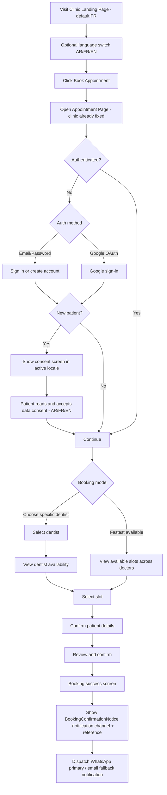
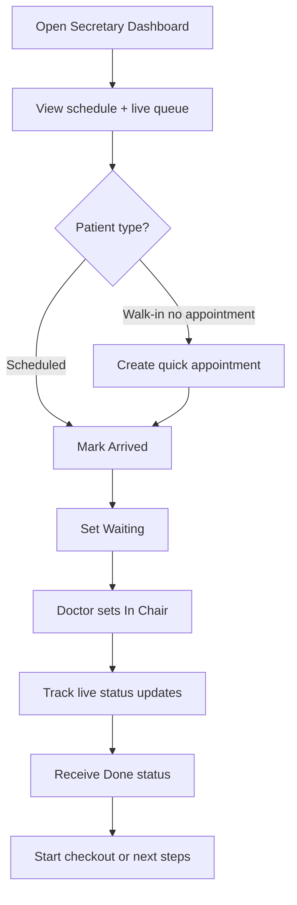
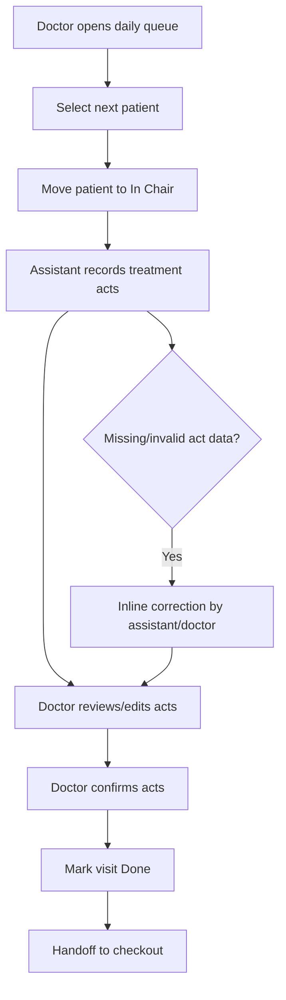

---
stepsCompleted:
  [
    step-01-init,
    step-02-discovery,
    step-03-core-experience,
    step-04-emotional-response,
    step-05-inspiration,
    step-06-design-system,
    step-07-defining-experience,
    step-08-visual-foundation,
    step-09-design-directions,
    step-10-user-journeys,
    step-11-component-strategy,
    step-12-ux-patterns,
    step-13-responsive-accessibility,
    step-14-complete,
  ]
lastStep: step-14-complete
workflowStatus: complete
createdAt: "2026-04-07"
updatedAt: "2026-04-07"
completedAt: "2026-04-07"
outputFile: docs/planning-artifacts/ux-design-specification.md
inputDocuments:
  - docs/planning-artifacts/prd.md
  - docs/planning-artifacts/product-brief-dentilflow-frontend.md
workflowType: ux-design
---

# UX Design Specification dentilflow-frontend

**Author:** Abdelaziz
**Date:** 2026-04-07

---

<!-- UX design content will be appended sequentially through collaborative workflow steps -->

## Executive Summary

### Project Vision

DentilFlow is a trilingual, operations-critical dental clinic platform designed for Morocco and Algeria. The UX vision is to deliver pro-system reliability with locally native usability: patients get frictionless mobile booking in their language, while clinic teams run daily operations through fast, responsive dashboards with clear role boundaries and real-time state visibility.

### Target Users

Primary patient users are mobile-first and need a fast, low-friction booking and notification experience in Arabic, French, or English. Secretariat users are the operational core and require high-efficiency queue and appointment control. Doctors and assistants need low-latency treatment flow continuity from queue to chair to checkout. Admin users need responsive configuration and oversight views suitable for desktop-first management tasks.

### Key Design Challenges

DentilFlow must reconcile Arabic RTL and French/English LTR behavior without visual or interaction regressions in critical workflows. The system must maintain pro-level operational clarity across multi-role real-time queue states to avoid handoff errors. Notification UX must combine formal clinical trust with friendly human tone, adapted by context while remaining consistent and compliant.

### Design Opportunities

A pro-system interaction model can become a competitive advantage by making the secretary cockpit measurably faster than paper/phone workflows. Mobile-first patient booking can create strong adoption by enabling fast after-hours appointments with confidence in confirmation and reminders. A unified trilingual design language with robust directionality can establish DentilFlow as the first region-native clinical operations experience rather than a translated generic SaaS.

## Core User Experience

### Defining Experience

DentilFlow’s core daily experience centers on secretariat queue and status operations as the highest-frequency action. The UX must feel like a pro clinical operations system: fast state changes, dense but legible information, minimal clicks, and clear role-based responsibilities. The product’s value loop combines this operational core with patient self-booking and downstream checkout continuity.

### Platform Strategy

The platform strategy is confirmed as:

- Patients: mobile-web-first experience optimized for quick booking, reminders, and simple follow-up actions.
- Staff/Admin: responsive web dashboards optimized for desktop/laptop operational use.

Connectivity strategy is currently undecided. Recommended direction: online-first with resilient behavior (reconnect, state recovery, and safe retry) until offline requirements are finalized.

### Effortless Interactions

The “effortless” bar is benchmarked to pro systems:

- Secretary updates queue states in seconds with near-zero cognitive overhead.
- Appointment intake/changes happen with predictable, low-friction flows.
- Patient booking remains short, guided, and confidence-building.
- Critical transitions (Arrived → Waiting → In Chair → Done) are visually obvious and hard to misfire.
- Notifications are automatic, context-aware, and tonally balanced (formal clinical + friendly human).

### Critical Success Moments

DentilFlow has three parallel make-or-break moments:

1. Midnight patient booking success (first self-service activation moment).
2. Secretary–doctor real-time sync confidence (operational trust moment).
3. Fast checkout with balance handling (financial closure and continuity moment).

Failure in any one of these weakens perceived product reliability; excellence in all three creates strong adoption and retention.

### Experience Principles

- Operational clarity first: Every screen must reduce ambiguity in live clinic operations.
- Speed with safety: Fast actions, but with guardrails against high-cost errors.
- Role-native UX: Each role sees only what they need, in the order they need it.
- Localized by design: Arabic RTL and French/English LTR are first-class, not adapted late.
- Confidence through feedback: Every important action returns immediate, clear system confirmation.
- Online-first resilience: Real-time performance is primary, with graceful recovery on unstable networks.

## Desired Emotional Response

### Primary Emotional Goals

- Patient: feel reassured, respected, and in control during booking and follow-up.
- Secretariat: feel calm control under pressure, with confidence that the queue state is always accurate.
- Doctor and dental assistant: feel synchronized, focused, and clinically safe during live treatment flow.
- Admin: feel operationally confident, informed, and in command of clinic configuration and oversight.

Across all roles, the emotional target is professional reliability with human warmth.

### Emotional Journey Mapping

- First encounter: users feel clarity and legitimacy immediately (professional, trustworthy, local-language native).
- Core interaction: users feel speed with control (fast actions, no ambiguity, clear feedback loops).
- Task completion: users feel closure and confidence ("done correctly, nothing was missed").
- Error or disruption moments: users feel informed and protected, not abandoned.
- Return usage: users feel familiarity and reduced cognitive load, reinforcing daily habit formation.

### Micro-Emotions

- Confidence over confusion in all role-critical actions.
- Trust over skepticism through transparent status, permissions, and confirmations.
- Calm over anxiety during queue pressure and checkout transitions.
- Accomplishment over frustration after each completed workflow stage.
- Satisfaction over novelty; delight is subtle and functional rather than decorative.

### Design Implications

- Calm control → Use stable layout regions, predictable interaction patterns, and persistent status visibility.
- Trust and safety → Show explicit confirmation states, audit-friendly language, and role-appropriate access signals.
- Speed confidence → Minimize action depth for high-frequency tasks and provide immediate, contextual feedback.
- Human warmth within professional tone → Use concise, respectful copy with gentle reassurance in notifications and system responses.
- Failure resilience → Prefer explicit recovery messaging and safe retries instead of silent ambiguous states.

### Emotional Design Principles

- Professional first, human always.
- Clarity is emotional safety.
- Real-time transparency builds trust.
- Fast interactions must still feel deliberate and safe.
- Localization should feel native, not translated.
- In high-pressure clinic contexts, calm UX is a product feature.

## UX Pattern Analysis & Inspiration

### Inspiring Products Analysis

- Doctolib: Strong patient booking confidence, clear slot visibility, and low-friction confirmation flow.
- Google Calendar: Fast scheduling primitives, dependable state clarity, and excellent time-based scanning.
- Linear: Dense but readable pro interface, speed-focused workflows, and minimal interaction friction.

### Transferable UX Patterns

Navigation patterns:

- Role-based primary navigation with stable screen anchors.
- Split “today operations” versus “future scheduling” views to reduce cognitive switching.

Interaction patterns:

- One-tap status transitions for high-frequency queue updates.
- Inline edit/confirm flows instead of modal-heavy interactions.
- Immediate feedback after every critical action.

Visual patterns:

- Dense operational tables with strong hierarchy and scan-friendly spacing.
- Color + icon + text redundancy for status communication (including RTL contexts).

### Anti-Patterns to Avoid

- Overly decorative UI that hides operational state.
- Deep multi-step forms for frequent secretary actions.
- Ambiguous queue ownership between roles.
- RTL support as an afterthought (mirrored but semantically broken layouts).
- Silent failures on real-time updates.

### Design Inspiration Strategy

What to adopt:

- Pro-dashboard information hierarchy and rapid status operations.
- High-confidence booking flow with explicit confirmations.

What to adapt:

- Dense operations UI adapted for trilingual RTL/LTR requirements.
- Calendar/schedule patterns adapted for clinic-specific queue lifecycle.

What to avoid:

- Consumer-style playful interactions in mission-critical clinic workflows.
- Any pattern that increases ambiguity in handoffs.

## Design System Foundation

### 1.1 Design System Choice

Use a hybrid themeable system: MUI + Tailwind CSS + design tokens.

### Rationale for Selection

- Best balance of speed versus uniqueness for MVP.
- MUI provides mature, accessible components and strong RTL support for Arabic.
- Tailwind CSS provides fast layout and responsive implementation velocity.
- Shared design tokens preserve consistency across both systems.
- The ecosystem is maintainable and well-documented for long-term growth.

### Implementation Approach

- Use MUI for complex, interactive components (forms, dialogs, data tables, date/time pickers, validation-heavy flows).
- Use Tailwind CSS for page layout, spacing, responsive behavior, and utility-level styling.
- Establish a single token layer (color, typography, spacing, radius, elevation, motion) consumed by both systems.
- Build role-specific layout shells: Patient Mobile Shell and Staff/Admin Dashboard Shell.
- Create reusable domain components for high-frequency actions such as queue rows, status chips, quick action bars, and localized date-time displays.
- Enforce WCAG 2.1 AA baseline and RTL/LTR visual regression testing in CI.

### Customization Strategy

- Keep base primitives from MUI and customize through tokenized theming rather than ad-hoc overrides.
- Introduce branded wrappers only for domain-critical components where product differentiation matters.
- Define clear component ownership to avoid style collisions (MUI for complex controls, Tailwind for structural styling).
- Centralize localization and role-aware microcopy to preserve formal-clinical yet friendly-human tone.
- Add interaction guardrails for critical state transitions to reduce operational errors.

## 2. Core User Experience

### 2.1 Defining Experience

The defining experience of DentilFlow is real-time clinic flow orchestration: the secretary updates queue state, doctor and assistant immediately see synchronized status, and the visit transitions cleanly to checkout without verbal coordination or paper fallback. If this loop feels instant, clear, and safe, the whole product feels superior.

### 2.2 User Mental Model

Users think in operational states, not technical events.

- Secretariat mental model: Who is next, where are bottlenecks, what changed now?
- Doctor and assistant mental model: Who is in chair now, what context is needed immediately?
- Patient mental model: Did my booking or visit status succeed, and what happens next?

Current manual approaches rely on calls, memory, and paper. Users expect digital tools to remove ambiguity rather than add steps.

### 2.3 Success Criteria

- Queue and status updates are visible cross-role in near real time.
- High-frequency actions require minimal clicks and no mode confusion.
- Users always understand current state, next action, and ownership.
- Core loop completion (Arrived → Waiting → In Chair → Done → Checkout) is fast and error-resistant.
- Users report “this just works” under daily clinic pressure.

### 2.4 Novel UX Patterns

DentilFlow should primarily use established pro-system patterns (tables, status chips, quick actions, confirmations), combined in a localized trilingual real-time orchestration model. Innovation should come from reliability, localization, and handoff clarity rather than unfamiliar interaction metaphors.

### 2.5 Experience Mechanics

1. Initiation

- Secretary opens daily operations view and sees prioritized queue and schedule.

2. Interaction

- User triggers one-tap status transitions and quick appointment actions.
- System validates role permissions and slot/state constraints inline.

3. Feedback

- Immediate visual confirmation (status change, timestamp, actor context).
- Cross-role propagation confirms a shared operational truth.
- Clear recovery messaging handles delayed sync or unstable network conditions.

4. Completion

- Patient reaches checkout with complete visit context.
- Payment and balance updates close the loop.
- System suggests the next operational action automatically (next patient, follow-up scheduling).

## Visual Design Foundation

### Color System

- Primary palette: clinical blue family for trust and reliability.
- Secondary palette: teal accents for action guidance and supportive emphasis.
- Neutral palette: cool grays for dense operational UI readability.
- Semantic mapping:
  - Success: green
  - Warning: amber
  - Error: red
  - Info: blue
- Queue state mapping: each state uses text + icon + color (never color-only).
- RTL/LTR parity: semantic meaning remains identical across locales.

### Typography System

- Primary UI font: Inter (Latin) with Arabic companion font (Cairo or Tajawal) by locale.
- Tone: professional, modern, high legibility.
- Type scale: clear hierarchy for dashboards (H1-H6 + body + caption).
- Readability: medium weights for dense tables; increased Arabic line-height for readability.
- Numeric clarity: tabular numerals for time, pricing, and queue counts.

### Spacing & Layout Foundation

- Base spacing unit: 8px system.
- Layout style: dense-efficient for staff dashboards, cleaner rhythm for patient mobile.
- Grid strategy:
  - Patient mobile: single-column with progressive disclosure.
  - Staff/admin desktop: multi-column operational grid with persistent context panes.
- Component rhythm: tight vertical spacing for operations lists, consistent tokenized padding for cards/tables/forms.
- Interaction zones: touch targets remain accessible in mobile patient flows.

### Accessibility Considerations

- Target WCAG 2.1 AA minimum.
- Contrast-safe tokens for all semantic states.
- Keyboard and focus visibility for staff/admin workflows.
- Screen-reader labels for statuses, actions, and confirmations.
- No information conveyed by color alone.
- Motion kept subtle and optional in critical workflows.

## Design Direction Decision

### Design Directions Explored

Six design directions were explored across operational density, patient-mobile clarity, and emotional tone.

### Chosen Direction

D5 — Patient Confidence Mobile.

### Design Rationale

D5 best supports the primary adoption moment: successful first-time patient booking with confidence. It aligns with the mobile-first patient strategy while remaining compatible with pro-system staff/admin operations.

### Implementation Approach

- Use D5 as the base visual direction for patient experiences.
- Keep staff/admin on a pro-system information hierarchy optimized for speed and clarity.
- Include dual-theme support (Light Mode + Dark Mode) as a first-class product requirement.
- Implement token-based theming so semantic colors, elevation, and typography behavior remain consistent in both themes.
- Validate contrast, status legibility, and RTL/LTR behavior in both themes under WCAG 2.1 AA constraints.

## User Journey Flows

### Journey 1: Patient Booking via Landing Page + Authentication

Language selection is done on the clinic landing page, which defaults to French.

**Consent screen design notes (FR38):**

- Displayed immediately after account creation, before returning to booking flow.
- Consent text is rendered in the active locale (Arabic RTL / French / English).
- Explicit accept action required — pre-ticked checkboxes are not acceptable under PDPC/CNDP/INPDP.
- Consent is non-blocking for the booking flow only after acceptance; skipping is not permitted.
- Copy must be reviewed for legal accuracy per country before commercial launch.

**Notification confirmation design notes (FR13):**

- `BookingConfirmationNotice` component displays on the booking success screen.
- Shows: appointment reference, date/time, doctor name, and which notification channel was used (WhatsApp or email).
- If WhatsApp delivery is pending: "A WhatsApp confirmation will arrive shortly."
- If WhatsApp fails and email fallback is used: "We sent your confirmation to your email address."
- If both channels fail (graceful degradation): "Your booking is confirmed. Save your reference: [REF]."
- Tone: calm, reassuring, and explicit — eliminates Yasmine's "did it work?" anxiety moment.

### Journey 2: Secretariat Queue + Walk-In Intake

Secretariat handles scheduled appointments and also newly arrived patients without existing appointments.

### Journey 3: Dentist + Assistant Clinical Flow

### Journey Patterns

- Language context begins at landing page (default FR) and persists across booking.
- Authentication is required before appointment confirmation. Two parallel paths: email/password (primary) and Google OAuth (low-friction alternative).
- New patient registration triggers the `PatientConsentScreen` — consent is mandatory before proceeding; language context is inherited from the active locale.
- Booking success always renders `BookingConfirmationNotice` with notification channel confirmation and graceful fallback messaging.
- Walk-in intake is a first-class secretary workflow.
- Real-time cross-role synchronization is mandatory across Secretary, Doctor, and Assistant views.
- Each workflow stage has explicit ownership and handoff signals.

### Flow Optimization Principles

- Reduce patient steps-to-booking while preserving trust and clarity.
- Keep walk-in intake and queue updates fast, minimal, and error-resistant.
- Minimize dentist cognitive load during active care.
- Preserve assistant speed with doctor confirmation as a clinical safety control.
- Maintain identical workflow semantics across light/dark modes and RTL/LTR layouts.

## Component Strategy

### Design System Components

Using the MUI + Tailwind CSS foundation, leverage standard components for forms, inputs, selects, dialogs, toasts, date/time pickers, data tables, tabs, buttons, chips, badges, cards, drawers, and responsive layout primitives.

### Custom Components

### LanguageSwitcher

**Purpose:** Landing-page language control with French as default and Arabic/English switching.
**Usage:** Landing and top-level navigation surfaces.
**States:** Default, active locale, disabled.
**Accessibility:** Keyboard operable with clear locale labels.

### BookingModeSelector

**Purpose:** Let patient choose specific dentist or fastest available slot.
**Usage:** Appointment page before slot browsing.
**States:** Mode selected, validation, loading.
**Accessibility:** Explicit labels and focus order.

### DentistAvailabilityPanel

**Purpose:** Display dentist-specific availability and slot selection.
**Usage:** Patient booking flow.
**States:** Available, partially booked, unavailable, empty.
**Accessibility:** Screen-reader-friendly slot metadata.

### ClinicQueueBoard

**Purpose:** Live operations surface for secretary queue orchestration.
**Usage:** Daily operations dashboard.
**States:** Synced, delayed sync, conflict, retry.
**Accessibility:** Keyboard actions and status announcements.

### WalkInQuickIntake

**Purpose:** Rapidly create appointments for newly arrived walk-in patients.
**Usage:** Secretary intake path.
**States:** New, prefilled, validation error, submitted.
**Accessibility:** Error summaries and input association.

### TreatmentActsEditor

**Purpose:** Assistant enters treatment acts; doctor reviews and confirms.
**Usage:** In-chair clinical workflow.
**States:** Draft, pending confirmation, corrected, confirmed.
**Accessibility:** Structured form grouping and inline errors.

### CheckoutBalanceSummary

**Purpose:** Summarize totals, payments, and carry-forward balance.
**Usage:** Checkout step after visit completion.
**States:** Paid in full, partial payment, outstanding, settled.
**Accessibility:** Numeric clarity and semantic alerts.

### ThemeModeToggle

**Purpose:** Switch and persist light/dark mode.
**Usage:** Patient and staff surfaces with role-aware defaults.
**States:** Light, dark, system preference.
**Accessibility:** Clear toggle labels and state announcements.

### BookingConfirmationNotice

**Purpose:** Communicate post-booking notification status clearly so the patient knows their confirmation was sent and via which channel.
**Usage:** Booking success screen, immediately after confirmed appointment creation.
**States:**

- `whatsapp-sent` — "Your WhatsApp confirmation is on its way."
- `email-fallback` — "We sent your confirmation to your email address."
- `notification-failed` — "Your booking is confirmed. Save your reference: [REF]."
- `pending` — "Sending your confirmation..." (brief transient state).
  **Accessibility:** Role=`status` ARIA live region so screen readers announce the confirmation outcome. Reference number is readable and copyable.
  **RTL/LTR:** Message text and icon layout must mirror correctly in Arabic.

### PatientConsentScreen

**Purpose:** Present clear, language-appropriate data consent to new patients at registration — satisfying PDPC, CNDP, INPDP, and GDPR obligations.
**Usage:** Shown once, immediately after account creation, before returning to the booking flow.
**States:**

- `idle` — Consent text displayed, accept action available.
- `accepted` — Consent recorded, flow proceeds.
- `error` — Submission failed, retry available.
  **Design constraints:**
- No pre-ticked checkboxes — explicit opt-in only.
- Consent text rendered in the active locale (AR/FR/EN); locale cannot be changed mid-consent without restarting.
- Accept button is the primary action; no skip or dismiss option.
- Scrollable content area for longer legal text with visible scroll indicator.
  **Accessibility:** Full keyboard navigation; consent text is screen-reader accessible; accept button has explicit aria-label including locale context.

### Component Implementation Strategy

- Use MUI for complex interactive controls and accessibility-heavy inputs.
- Use Tailwind CSS for layout composition, spacing, and responsive structure.
- Centralize design tokens for color, typography, spacing, elevation, and motion.
- Ensure all custom components support RTL/LTR and light/dark theming.
- Apply consistent ARIA semantics and keyboard behavior across all critical components.

### Implementation Roadmap

**Phase 1 - Core Booking & Queue:** PatientConsentScreen, BookingModeSelector, DentistAvailabilityPanel, BookingConfirmationNotice, ClinicQueueBoard, WalkInQuickIntake, ThemeModeToggle.

**Phase 2 - Clinical & Checkout:** TreatmentActsEditor, CheckoutBalanceSummary.

**Phase 3 - Cross-Cutting UX:** LanguageSwitcher.

## UX Consistency Patterns

### Button Hierarchy

- Primary buttons for the single most important action in each context.
- Secondary buttons for supporting actions with lower emphasis.
- Tertiary/text actions for low-risk utilities.
- Destructive actions require distinct styling and explicit confirmation.
- Hierarchy remains consistent across light/dark modes and RTL/LTR.

### Feedback Patterns

- Success: concise confirmation and clear next action.
- Error: specific cause, actionable recovery guidance, and preserved user context.
- Warning: preventive messaging before irreversible or high-risk actions.
- Info: contextual hints without blocking user progress.
- Queue/status updates always produce immediate visual feedback.

### Form Patterns

- Inline validation on blur plus final validation on submit.
- Error summaries for longer forms, especially secretary/admin operational forms.
- Required fields clearly marked and language-localized.
- Smart defaults for repetitive workflows (walk-in intake, slot operations).
- Consistent auth feedback for Google sign-in and email/password paths.

### Navigation Patterns

- Patient navigation: simplified mobile-first progression with progressive disclosure.
- Staff/admin navigation: dashboard-first, information-dense, role-centered structure.
- Persistent context separation for “today operations” vs “future schedule”.
- Clear back navigation and flow continuity in multi-step journeys.

### Additional Patterns

- Loading states: skeletons for lists/tables, compact spinners for short actions.
- Empty states: explain status and provide one recommended next action.
- Modal usage: reserved for high-focus decisions; avoid stacked modal chains.
- Search/filter behavior: immediate result feedback with persistent filter memory where useful.
- Theme consistency: status semantics and interaction meaning remain identical in dark/light modes.

## Responsive Design & Accessibility

### Responsive Strategy

- Patient surfaces are mobile-first and task-focused, prioritizing fast booking and status clarity.
- Staff/admin surfaces are responsive desktop-first operations UIs, optimized for dense workflows while remaining tablet-usable.
- Tablet experiences use adaptive layouts with touch-ready controls for moving between reception and chair-side contexts.
- Information hierarchy differs by device: essential actions first on mobile, expanded context on larger screens.

### Breakpoint Strategy

- Mobile: 320px-767px
- Tablet: 768px-1023px
- Desktop: 1024px+
- Implement with mobile-first media queries and component-level adaptation, not page-only collapses.

### Accessibility Strategy

- Compliance target: WCAG 2.1 AA baseline.
- Keyboard navigation is mandatory for all critical staff/admin actions.
- Screen reader support is required for queue states, transitions, confirmations, and form errors.
- Minimum touch targets are enforced for patient mobile actions.
- Color is never the only status signal; pair with text/icon semantics.
- Accessibility parity is maintained across light and dark modes.

### Testing Strategy

- Real-device responsive testing across representative iOS/Android phones and tablets.
- Cross-browser validation for Chrome, Safari, Firefox, and Edge.
- Automated accessibility checks (e.g., axe/Lighthouse) plus manual keyboard-only testing.
- Screen reader spot checks using NVDA and VoiceOver.
- RTL/LTR and light/dark visual regression snapshots for critical journeys.

### Implementation Guidelines

- Prefer semantic HTML and use ARIA to enhance semantics where needed.
- Keep focus indicators visible and consistent in all themes.
- Enforce logical tab order and skip-link patterns on dashboard-heavy views.
- Use token-driven typography and contrast values to guarantee theme consistency.
- Validate all core journeys under Arabic RTL and French/English LTR.
